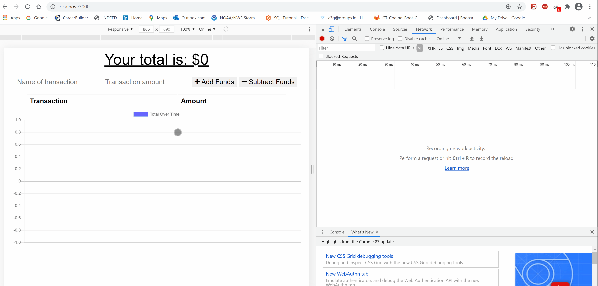
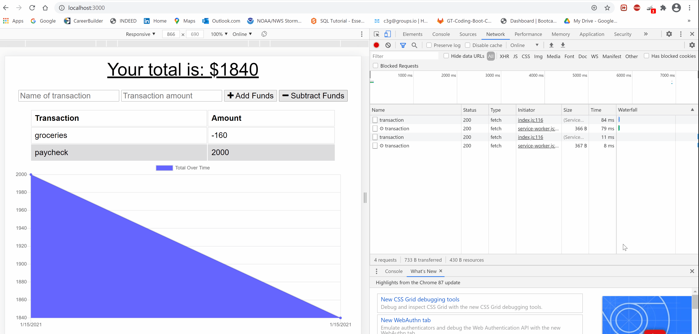

# Online/Offline Budget Tracker

## Initial setup for local usage (installing npm packages):

Clone the repository from Github. In gitbash, run command npm install, and all node modules should be installed to your local instance. 

## User Story:

AS A USER,

I want to be able to track my budgets in an application that works seamlessly whilst both online and offline, without losing any data in the process incase I choose to go offline/online, or I lose/gain internet connection.

## Method:

Using DB, Manifest, and Service-worker, we are able to store data and test to see if the application is online/offline, and still update the application with data regardless of internet status. If the application is offline, data that was entered offline will still be added once the application is online.

## Demonstration:

### -Using Online

### -Using Offline

## Technologies Used:

API routes

MongoDB for database

Manifest, DB, and Service-Worker for allowing seamless offline/online use

## Deployed Heroku link:

https://calm-cliffs-61785.herokuapp.com/
